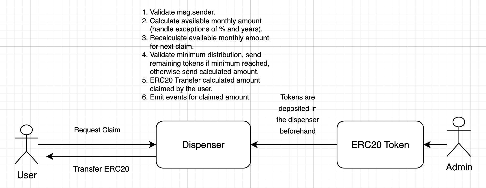
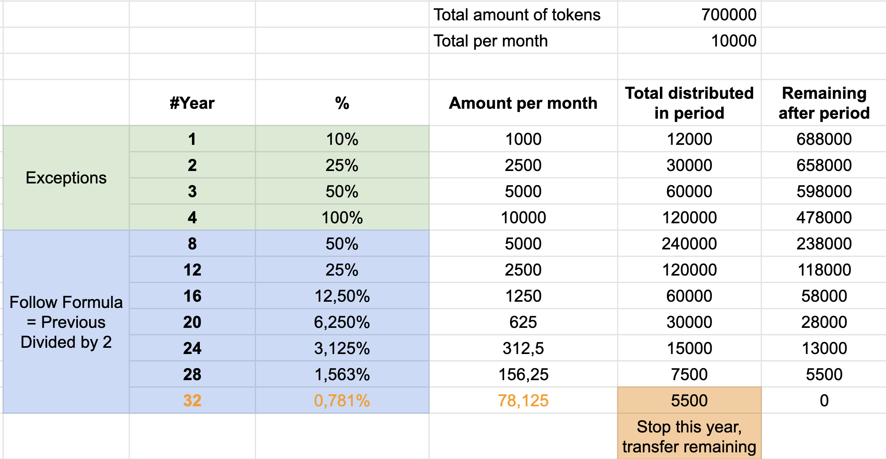
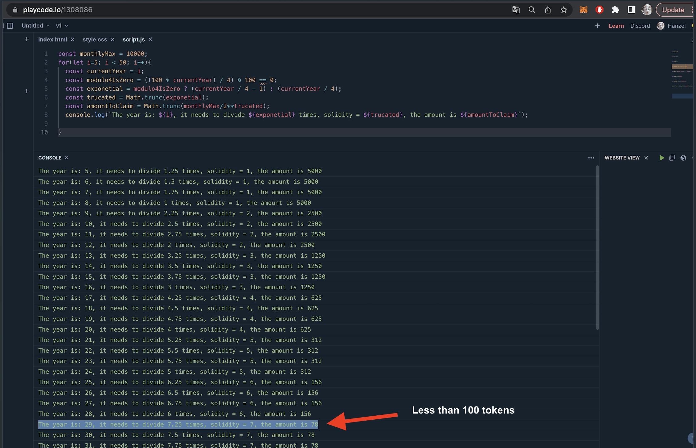

# ERC20 Token Dispenser

## Instructions

Design and code a smart contract (or set of smart contracts) that will distribute ERC20 tokens over time, on a predetermined schedule.

The system must provide a mechanism to distribute the tokens monthly. This could be in one or many payments.

"It is important is that under no circumstances we distribute more than the specified amount in any month". Due to this restriction, if the receiver forgets to claim in some months, the system will only be able to pay what is available only in the current month.

### High-level system architecture

### Math validation

These mathematical validations represent what the claimed amounts would look like if the user claimed every month. But the logic of the contract considers that the user could forget to claim some months.

### Formula validation for years greater than 4

