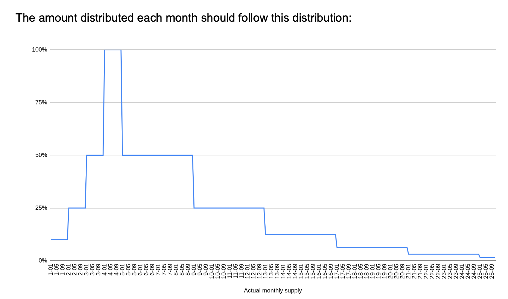
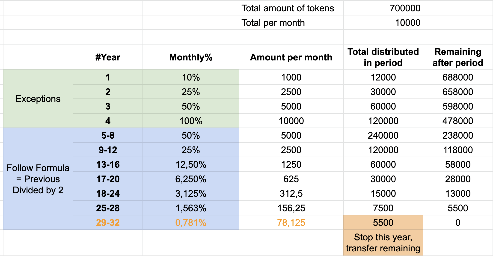
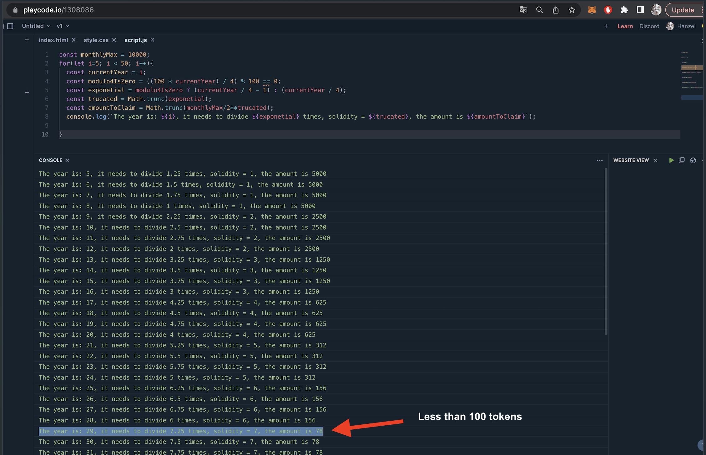
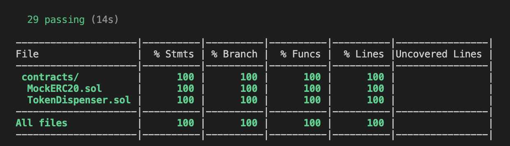
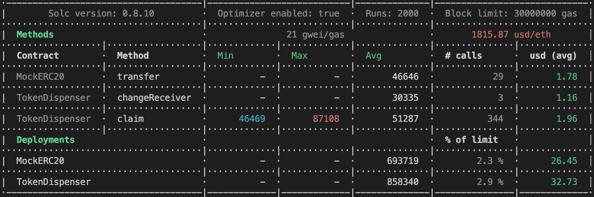
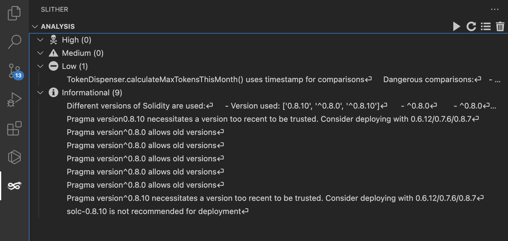

# ERC20 Token Dispenser

## Instructions

Design and code a smart contract (or set of smart contracts) that will distribute ERC20 tokens over time, on a predetermined schedule.

The system must provide a mechanism to distribute the tokens monthly. This could be in one or many payments.

"It is important is that under no circumstances we distribute more than the specified amount in any month". Due to this restriction, if the receiver forgets to claim in some months, the system will only be able to pay what is available only in the current month.

## Deployed contract information

- Token Dispenser: https://goerli.etherscan.io/address/0x7965337DCe99895c52Af13B82d46519a2C3F9EfC#code
- ERC20 Token Address: https://goerli.etherscan.io/address/0xC681594E4F76c3Bf75761DC5189718d1F6677a0a#code
- Receiver Address: `0x15023b342BB80f6927e4F61734487572a5323836`
- Receiver PK: `4f0420804fcebe2060ecad9c1fdfa6f6e9603cfc73063d8d63242f0ba6e8f7b2`
- First claim: https://goerli.etherscan.io/tx/0x95b4083be7ad0a414d14074422c354856d1739cf4c8e197939601e93e2927555

## Guide

- Clone the repository, go to the `.envExample` file copy it and name it `.env`, please fill all variables.
- Make sure that after cloning the repository you run `npm run install`.
- The tests can be run with `npm run test`.
- The code has been tested with solidity coverage `npm run coverage`.

## High-level system architecture

## Math validation

These mathematical validations represent what the claimed amounts would look like if the user claimed every month. But the logic of the contract considers that the user could forget to claim some months.

## Formula validation for years greater than 4

## Coverage

## Gas reporter

## Security analysis

This project was tested with static security analysis tool called Slither with an extension for vscode.
The results show some low and informative bullet points, they were analyzed but they do not affect the desired behavior of the contract.
[Slither](https://github.com/crytic/slither) - Static analysis framework with detectors for many common Solidity issues.

## Notes

The contract layout was sorted according to the solidity docs [Functions Order](https://docs.soliditylang.org/en/v0.8.17/style-guide.html#order-of-functions) and [Layout Order](https://docs.soliditylang.org/en/v0.8.17/style-guide.html#order-of-layout). And following the [Naming convention.](https://docs.soliditylang.org/en/v0.8.17/style-guide.html#naming-conventions)

The code implements [Natspec documentation](https://docs.soliditylang.org/en/v0.8.17/natspec-format.html)
